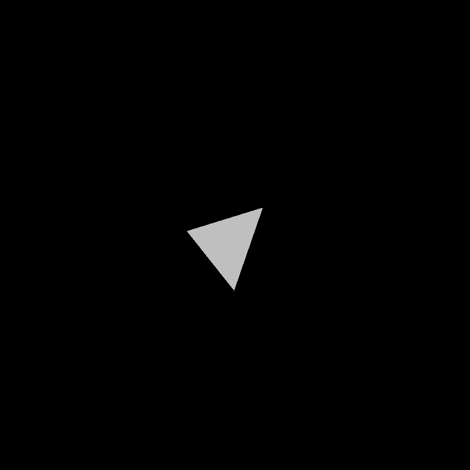
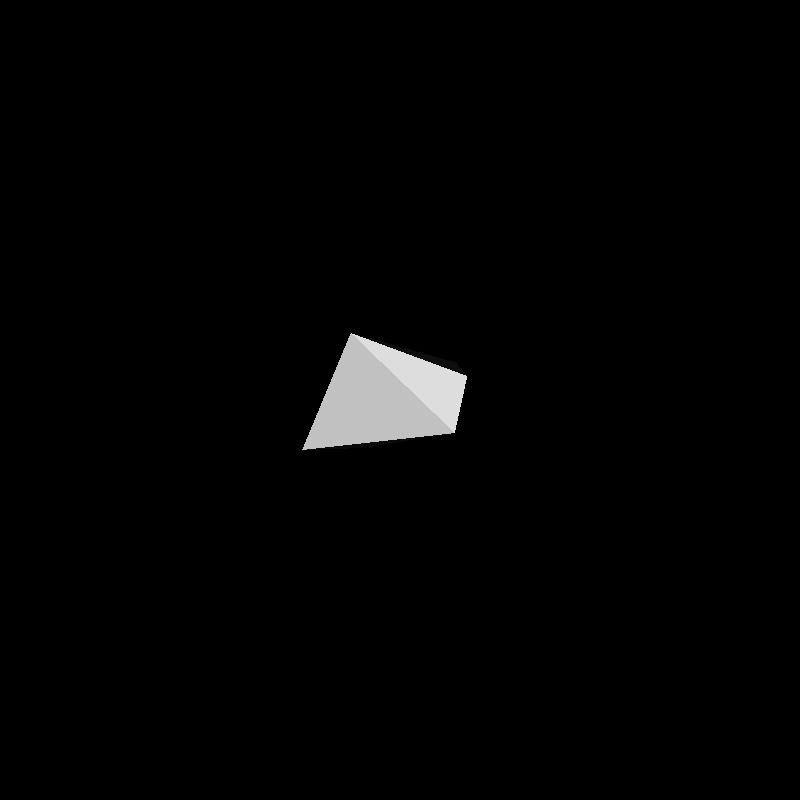
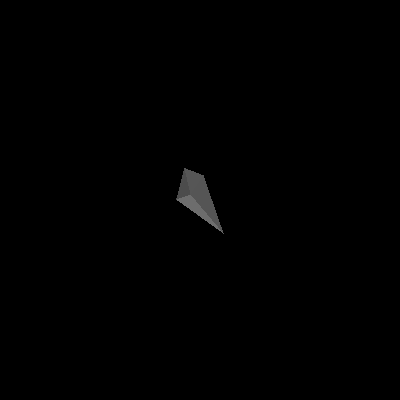
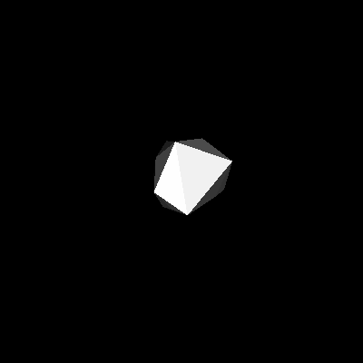
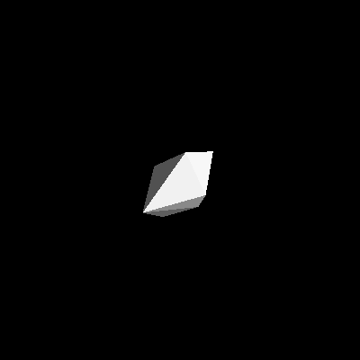

Given a graph, make each vertex repulse other verticies and make each edge a spring. Then you can simulate how each vertex would move to get a neat gif. You can also generate stl files.

This code does this simulation and the rendering. Here are some outputs. All the software is not optimized so it is fairly slow. But interesting!

<table>
  <tr>
    <td></td>
    <td></td>
    <td></td>
  </tr>
  <tr>
    <td></td>
    <td></td>
    <td></td>
  </tr>
</table>
